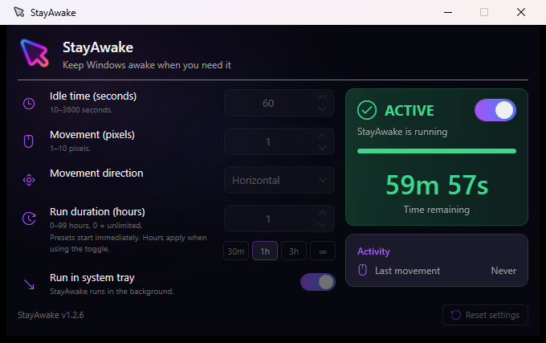
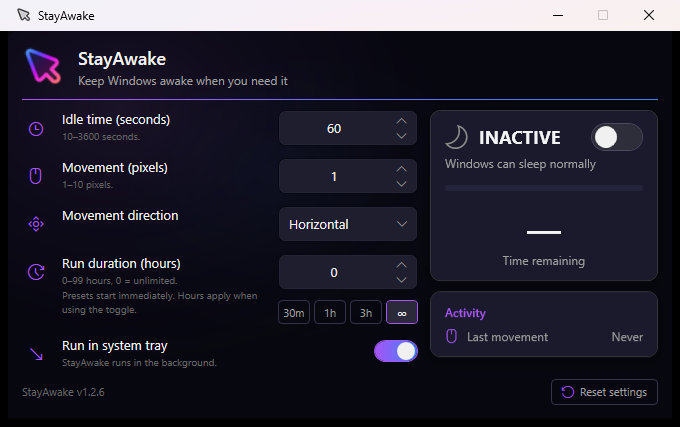
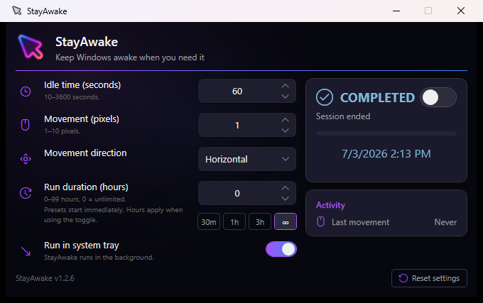
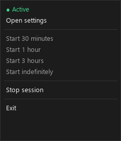

# StayAwake

A minimal Windows utility that keeps your PC awake when you need it—by detecting idle time and nudging the mouse in place, without moving the cursor from where you left it.

---

## Philosophy

StayAwake is intentionally **small**, **portable**, and **easy to reason about**:

- **One executable** — copy `StayAwake.exe` anywhere; settings live beside it as JSON.
- **No installer, no registry** — nothing to uninstall; delete the folder when done.
- **Tray-first** — runs quietly in the background; the window is for configuration.
- **Session-based** — enable for a set time or indefinitely; auto-stops when the session ends.
- **Minimal UI** — no dashboard, no accounts, no telemetry—just the controls you need.

The architecture stays flat on purpose: manual wiring in `App`, one background worker. See [docs/ARCHITECTURE.md](docs/ARCHITECTURE.md) for the full technical reference.

---

## Features

- **Idle detection** via Windows `GetLastInputInfo`
- **Invisible mouse jiggle** — `SendInput` moves the cursor slightly and returns it (configurable pixels and direction)
- **Keep-awake** — `SetThreadExecutionState` prevents display sleep and system idle while a session is active
- **Configurable idle threshold** — how long to wait after your last real input before nudging (10–3600 seconds; range shown in UI)
- **Numeric steppers** — idle, movement, and run duration use spinner buttons, Up/Down keys, and mouse wheel (idle steps by 10 seconds)
- **Session duration** — run for N hours or unlimited (`0` hours); auto-disable when time is up
- **Quick presets** — 30m / 1h / 3h / indefinite in the tray menu and main window
- **Tray icon states** — disabled, active, and session-completed variants at a glance
- **System tray** — presets, stop session, open settings
- **Portable settings** — `settings.json` next to the executable
- **Dark, compact UI** — single settings screen with a prominent status card: `ACTIVE`/`INACTIVE` at a glance, remaining time, and a decreasing progress bar (including session end date/time after a timed session completes)
- **Remaining-time progress bar** — subtle green bar that empties as the timed session counts down
- **Activity at a glance** — the clock time of the last mouse movement
- **Single instance** — prevents accidentally running two copies

---

## Screenshots

| Active session | Inactive |
|----------------|----------|
|  |  |

| Session completed (shows **Session ended** time) | Tray menu |
|-------------------|-----------|
|  |  |

To regenerate images, see [docs/screenshots/README.md](docs/screenshots/README.md).

---

## Requirements

- **Windows 10** or later
- **[.NET 8 SDK](https://dotnet.microsoft.com/download/dotnet/8.0)** (to build from source)

No administrator rights required to run.

---

## Quick start

1. Build or download `StayAwake.exe` (see [Publish](#publish-single-portable-exe) below).
2. Run it. On first launch, `settings.json` is created beside the EXE. If Windows blocks the app, see [Windows Defender and SmartScreen](#windows-defender-and-smartscreen).
3. Turn **Enabled** on and set **Idle time** (e.g. `60` seconds).
4. Leave the PC idle — after the threshold, the mouse nudges once per idle period (cursor stays in place).
5. Optional: enable **Run in system tray** and close the window; the app keeps running from the tray icon.

---

## Windows Defender and SmartScreen

StayAwake is a portable, **unsigned** executable. Downloads from a browser or GitHub carry a Mark of the Web flag, and the app uses Win32 `SendInput` (synthetic mouse movement) and keep-awake APIs—behavior similar to other mouse-jiggler utilities. Windows may warn or block on first run even though the app does not require administrator rights and is [open source](#project-structure). You can also [build from source](#build) if you prefer.

### SmartScreen: "Windows protected your PC"

Click **More info**, then **Run anyway**. An unknown publisher is expected until the project adopts code signing.

### Unblock the downloaded file

Right-click `StayAwake.exe` → **Properties** → check **Unblock** → **Apply**, or run:

```powershell
Unblock-File .\StayAwake.exe
```

### If Microsoft Defender quarantines or blocks the app

1. Open **Windows Security** → **Virus & threat protection** → **Manage settings** → **Exclusions**.
2. Add an exclusion for the **folder** where you keep `StayAwake.exe` (or the file itself). Only exclude paths you trust.

If you believe the detection is a false positive, submit the file via [Microsoft's malware analysis portal](https://www.microsoft.com/en-us/wdsi/filesubmission).

Building locally (see [Build](#build)) avoids browser download flags, but Defender may still prompt when a session starts because of input-simulation behavior.

**Note for maintainers:** Authenticode signing would reduce SmartScreen friction on release builds; it is not implemented today.

---

## Build

```powershell
cd path\to\stayawake
dotnet build StayAwake\StayAwake.csproj -c Release
```

Output: `StayAwake\bin\Release\net8.0-windows\StayAwake.exe`

---

## Publish (single portable EXE)

```powershell
dotnet publish StayAwake\StayAwake.csproj -c Release -r win-x64 --self-contained `
  -p:PublishSingleFile=true `
  -p:IncludeNativeLibrariesForSelfExtract=true
```

Output:

```
StayAwake\bin\Release\net8.0-windows\win-x64\publish\StayAwake.exe
```

Copy `StayAwake.exe` anywhere. `settings.json` is created on first run in the same directory.

### Releasing

Automated release to GitHub via [`scripts/release.ps1`](scripts/release.ps1): publish a single-file EXE, zip it, commit the version bump (if needed), tag, push, and create a GitHub Release.

#### One-time setup

1. Install [.NET 8 SDK](https://dotnet.microsoft.com/download/dotnet/8.0) and [GitHub CLI](https://cli.github.com/).
2. Log in to GitHub (required before a full release):

   ```powershell
   gh auth login
   gh auth status
   ```

3. After installing `gh`, open a **new** terminal so `gh` is on `PATH`. The release script also looks for `C:\Program Files\GitHub CLI\gh.exe` if needed.

#### Branching

After v1.0.0, day-to-day work happens on **`develop`**; releases merge into **`main`** and run `release.ps1` there. See [docs/BRANCHING.md](docs/BRANCHING.md).

#### Workflow

1. Merge `develop` → `main` when ready to ship. Commit and push on `main` (the script requires a **clean** working tree).
2. Choose `-Version` to match the release tag (`1.1.0` → tag `v1.1.0`). If `StayAwake.csproj` already has that version, the script skips a version commit and tags the current `HEAD`.
3. Test the build locally, then run a full release:

   ```powershell
   .\scripts\release.ps1 -Version 1.1.0 -SkipPush   # build + zip only
   .\scripts\release.ps1 -Version 1.1.0            # tag, push, GitHub Release
   ```

| Switch | Purpose |
|--------|---------|
| `-DryRun` | Print steps without publish, commit, tag, push, or `gh release` |
| `-SkipPush` | Publish and zip to `dist/` only (no git or GitHub steps) |

**Prerequisites for a full release:** Windows, .NET 8 SDK, authenticated `gh`, clean working tree on **`main`** (the script **refuses** other branches), local `main` matches `origin/main`, push access to `origin`.

**Release asset:** `dist/StayAwake-v{version}-win-x64.zip` containing **only** `StayAwake.exe` (icons embedded in the assembly). The `dist/` folder is gitignored.

#### GitHub Release description

Every full run of `release.ps1` fills the release body from [`scripts/GITHUB_RELEASE_NOTES.md`](scripts/GITHUB_RELEASE_NOTES.md). Edit that file to change install steps, requirements, or wording for **all future** releases.

Placeholders are replaced automatically:

| Placeholder | Example |
|-------------|---------|
| `{{TAG}}` | `v1.2.1` |
| `{{VERSION}}` | `1.2.1` |
| `{{ZIP_NAME}}` | `StayAwake-v1.2.1-win-x64.zip` |
| `{{PREV_TAG}}` | `v1.2.0` (latest `v*` tag before this release) |
| `{{REPO}}` | `victorj2307/stayawake` |
| `{{CHANGELOG_LINE}}` | `**Full Changelog**: https://github.com/victorj2307/stayawake/compare/v1.2.0...v1.2.1` (omitted on the first release) |

To fix an **already published** release, edit it on GitHub or use `gh release edit v1.2.0 --notes-file <rendered.md>` with placeholders already substituted.

#### Troubleshooting

| Problem | What to do |
|---------|------------|
| Working tree is not clean | Commit or stash changes, then rerun |
| `gh` not found | Install GitHub CLI and open a new terminal, or verify `C:\Program Files\GitHub CLI\gh.exe` exists |
| `gh is not authenticated` | Run `gh auth login` |
| Tag already exists | Use a new `-Version`, or delete the tag on GitHub if the release was a mistake |
| Released from `develop` by mistake | Merge `develop` → `main` and push; the tag still points at the same commit. Future releases must run on `main` (enforced by the script) |
| `Releases must be cut from branch 'main'` | `git checkout main`, merge `develop`, push, then rerun `release.ps1` |
| Push succeeded but `gh release create` failed | Create the release manually: `gh release create v1.1.0 dist/StayAwake-v1.1.0-win-x64.zip --title "StayAwake v1.1.0"` |

See [docs/ARCHITECTURE.md §16](docs/ARCHITECTURE.md#16-release-automation) for a short technical summary.

---

## Usage

### Enable a session (main window)

1. Set **Run duration (hours)** — `0` = unlimited until you stop the session.
2. Configure **Idle time**, **Movement**, and **Movement direction** as needed (type a value, use the ▲/▼ buttons, arrow keys, mouse wheel, or **Tab** to move between controls).
3. Toggle **Enabled** on. Settings lock while active; turn off to edit again.

### Tray menu

Right-click the tray icon:

| Menu item | Action |
|-----------|--------|
| Open settings | Show the main window |
| Start 30 minutes / 1 hour / 3 hours | Start a timed session |
| Start indefinitely | Start with no time limit |
| Stop session | End the current session |
| Exit | Quit the application |

Double-click the tray icon to open settings.

When a timed session ends, a tray balloon notifies you and status shows **Session completed**. Click the balloon to open settings.

### Run in system tray

With **Run in system tray** enabled, closing or minimizing the window hides it; the worker and tray icon keep running until you choose **Exit** from the tray.

When you start a session with run-in-system-tray on, or when you hide the window to the tray, a short tray balloon reminds you that StayAwake is still running in the notification area. Click the balloon or double-click the tray icon to open settings.

---

## Architecture overview

```
App (composition root)
 ├── SettingsStore → AppSettings (JSON)
 ├── StayAwakeWorker (1s timer loop) → NativeMethods (Win32)
 ├── MainViewModel → MainWindow (WPF)
 └── TrayIconManager (WinForms NotifyIcon)
```

**Runtime states:** `Disabled` → `Active` (session running) → `SessionCompleted` (timed session ended).

For state diagrams, worker loop pseudocode, Win32 details, and threading notes, see **[docs/ARCHITECTURE.md](docs/ARCHITECTURE.md)**.

---

## Runtime / session model

| State | Meaning |
|-------|---------|
| **Disabled** | Not keeping the system awake; settings editable |
| **Active** | Session running; keep-awake on; settings locked |
| **Session completed** | Timed session ended automatically; settings editable |

**Lifecycle:**

- **Start** — `StartSession(duration)` sets timestamps, enables keep-awake, begins idle monitoring.
- **Stop** — `StopSession()` or tray **Stop session** ends the session.
- **Auto-stop** — when `SessionEndsAt` is reached, status becomes **Session completed**, settings saved, tray balloon shown; the Status panel shows **Session ended** with the local date and time (in memory until you start a new session or disable).

**Idle behavior:** Each second, if you've been idle for at least `IdleSeconds` *and* the last synthetic jiggle was at least `IdleSeconds` ago, the worker nudges the mouse and resets the rate limit.

---

## UI philosophy

- **Compact utility** — one screen, no tabs or dashboards.
- **Dark theme** — purple/navy gradient background with radial glow; purple accent on interactive controls; green reserved exclusively for the **Active** state (status headline, remaining time, progress bar, state icon, and the active card highlight); Segoe MDL2 icons for settings rows.
- **Status card** — leads with the `ACTIVE`/`INACTIVE` state, a short description, the on/off toggle, a decreasing remaining-time progress bar, and the remaining time (or session ended date/time when completed); a separate **Activity** card shows the last-movement time—no log viewer.
- **Session-oriented workflow** — enable = start a session; configure duration and idle rules before or between sessions.
- **Bounded numeric inputs** — muted range hints, clamp on blur, and `NumericStepper` controls for the three numeric settings.
- **Keyboard-friendly** — Tab through all controls; focused fields show a purple border (matches the dark theme, no dashed system focus rectangle).

---

## Technical summary

| Mechanism | API / approach |
|-----------|----------------|
| Idle detection | `user32!GetLastInputInfo` |
| Mouse nudge | `user32!SendInput` (relative move out and back) |
| Prevent sleep | `kernel32!SetThreadExecutionState` while Active |
| Background loop | `PeriodicTimer` at 1 second |
| Settings | `System.Text.Json` → `settings.json` beside EXE |
| Movement mode | `MovementMode` enum with tolerant JSON converter |
| UI | WPF + minimal MVVM (`MainViewModel`) |
| Tray | Windows Forms `NotifyIcon` |

---

## Project structure

```
stayawake/
├── LICENSE
├── ATTRIBUTIONS.md
├── CHANGELOG.md
├── README.md
├── scripts/
│   └── release.ps1
├── docs/
│   ├── ARCHITECTURE.md
│   ├── BRANCHING.md
│   ├── POST_V1_ROADMAP.md
│   └── screenshots/
├── StayAwake.slnx
└── StayAwake/
    ├── App.xaml / App.xaml.cs
    ├── MainWindow.xaml / MainWindow.xaml.cs
    ├── MainViewModel.cs
    ├── NumericStepper.xaml / NumericStepper.xaml.cs
    ├── StayAwakeWorker.cs
    ├── TrayIconManager.cs
    ├── NativeMethods.cs
    ├── AppSettings.cs
    ├── SettingLimits.cs
    ├── AppStatus.cs
    ├── MovementMode.cs
    ├── MovementModeJsonConverter.cs
    ├── SessionDisplay.cs
    ├── SettingsStore.cs
    ├── RelayCommand.cs
    ├── StayAwake.csproj
    ├── Assets/
    └── scripts/
        ├── generate-icon.py
        ├── capture-screenshots.ps1
        ├── generate-tray-menu-screenshot.py
        └── ScreenshotTool/
```

---

## Settings (`settings.json`)

Created beside `StayAwake.exe` on first run.

```json
{
  "enabled": false,
  "movementPixels": 1,
  "idleSeconds": 60,
  "minimizeToTray": false,
  "movementMode": "Horizontal",
  "sessionDurationHours": 0,
  "sessionDurationMinutes": null
}
```

| Field | Type | Description |
|-------|------|-------------|
| `enabled` | bool | Whether a session is active (persisted across restarts) |
| `movementPixels` | int | Jiggle distance (1–10; UI steps by 1) |
| `idleSeconds` | int | Seconds of real idle before nudging (10–3600; UI steps by 10) |
| `minimizeToTray` | bool | Hide window on close/minimize instead of exiting |
| `movementMode` | enum | `Horizontal`, `Vertical`, or `Random` (unknown values default to `Horizontal`) |
| `sessionDurationHours` | int | Default duration when enabling from UI (`0` = unlimited; UI steps by 1) |
| `sessionDurationMinutes` | int? | When set (e.g. `30`), overrides hours for the default duration |

Out-of-range values in the file are clamped to valid bounds on load. In the UI, each numeric field shows its allowed range and supports typing, spinner buttons, Up/Down keys, and mouse wheel.

Tray and UI presets start sessions immediately and update the saved duration preference (`sessionDurationHours` and/or `sessionDurationMinutes`).

---

## Tray behavior

- **Icon:** State-specific embedded ICOs (`app-tray-disabled`, `app-tray-active`, `app-tray-completed`; fallback: `app.ico`, then system default).
- **Tooltip:** `StayAwake — Active`, `Active (1h 12m)`, `Active (no limit)`, `Inactive`, or `Session completed` (63-char limit).
- **Menu:** Rebuilt when opened; start presets disabled while a session is active.
- **Balloons:** "Session completed" when a timed session expires; "Still running in the system tray…" when you enable a session with minimize-to-tray or hide the window to the tray (not on every app restart if a session was already enabled). A single click on either balloon opens settings.

---

## Technical constraints

- **Windows only** — relies on Win32 APIs not available on other platforms.
- **Synthetic input** — jiggles count as input for Windows idle/lock; may not satisfy all third-party "presence" tools.
- **Policy overrides** — corporate Group Policy can still enforce lock or sleep.
- **No installer** — user manages the EXE and `settings.json` manually.

---

## Known limitations

Platform and policy constraints: [docs/ARCHITECTURE.md §13](docs/ARCHITECTURE.md#13-weaknesses-and-risks).

---

## Roadmap / future ideas

- Custom vector icon (replace Flaticon source) — planned for v1.2+
- Optional tray duration picker — evaluate carefully

**Not planned:** cloud sync, accounts, telemetry, plugins, schedulers, dashboards.

Shipped in v1.1.0 and post-v1 planning: [docs/POST_V1_ROADMAP.md](docs/POST_V1_ROADMAP.md). Full list: [docs/ARCHITECTURE.md §14](docs/ARCHITECTURE.md#14-future-opportunities).

---

## Contributing

StayAwake is meant to stay **small and understandable**:

- Match existing style: flat structure, no unnecessary abstractions.
- Avoid DI frameworks, plugin systems, or extra architecture layers.
- Prefer focused changes over large refactors.
- Update `docs/ARCHITECTURE.md` when behavior or structure changes meaningfully.
- Day-to-day work on **`develop`**; releases on **`main`** — [docs/BRANCHING.md](docs/BRANCHING.md).

### Icon assets

See [StayAwake/Assets/ICON.md](StayAwake/Assets/ICON.md) for regenerating `app.ico` and `app-header.png`. Third-party icon credits: [ATTRIBUTIONS.md](ATTRIBUTIONS.md).

### Screenshots

See [docs/screenshots/README.md](docs/screenshots/README.md) and `StayAwake/scripts/capture-screenshots.ps1`.

---

## Third-party assets

Icon and asset credits: [ATTRIBUTIONS.md](ATTRIBUTIONS.md).

---

## License

[MIT](LICENSE) — see [LICENSE](LICENSE) for details.

---

## Related documentation

- **[docs/ARCHITECTURE.md](docs/ARCHITECTURE.md)** — Technical reference: runtime model, worker loop, Win32, threading, health review.
