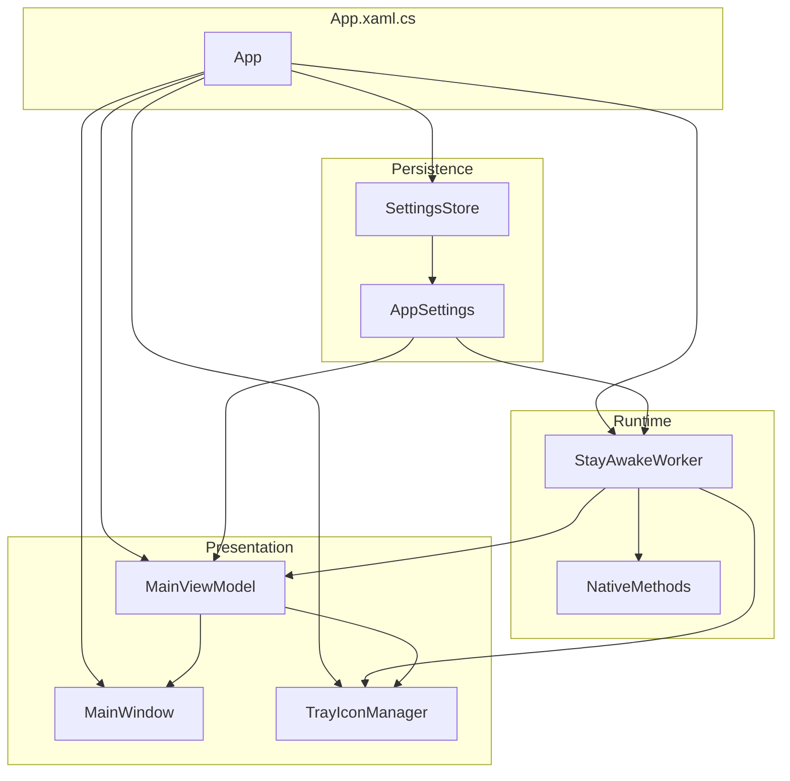
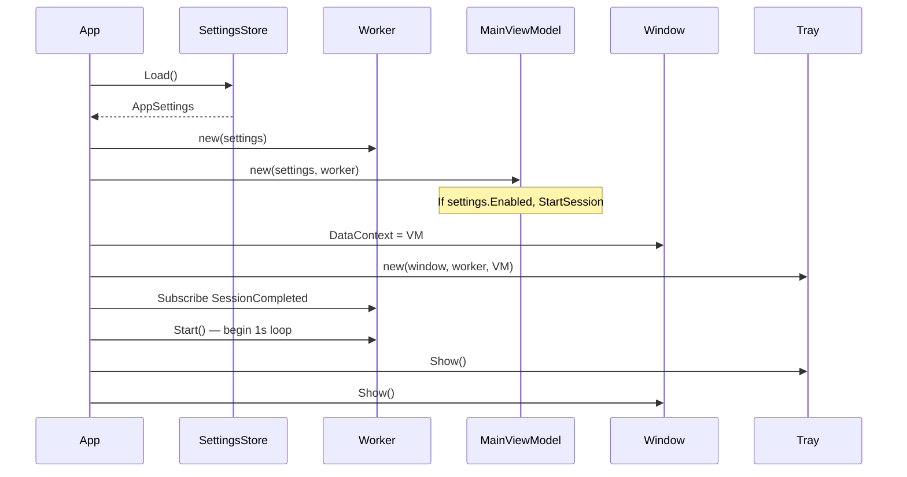
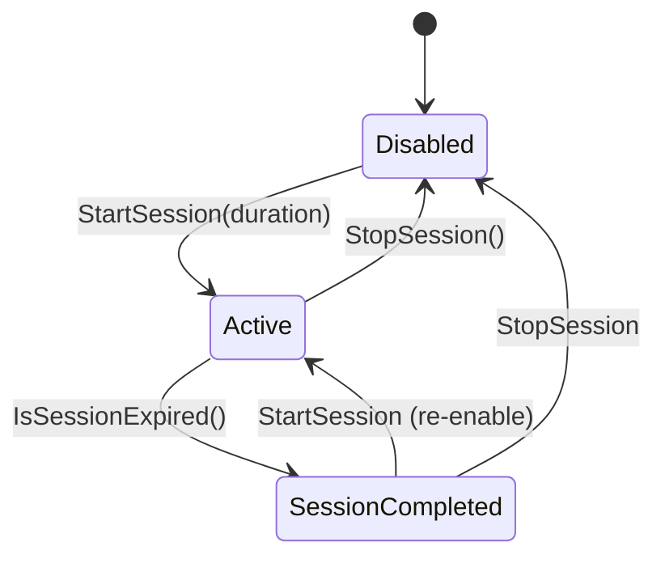

# StayAwake — Architecture & Technical Reference

This document is the deep technical reference for the StayAwake codebase. It describes the **real implementation** as it exists today—intended for contributors, future audits, and anyone who needs to reason about runtime behavior without reading every file.

For a shorter onboarding guide, see the [README](../README.md).

---

## Table of contents

1. [Design goals and non-goals](#1-design-goals-and-non-goals)
2. [Component overview](#2-component-overview)
3. [Application startup](#3-application-startup)
4. [Runtime state model](#4-runtime-state-model)
5. [Session lifecycle](#5-session-lifecycle)
6. [Worker loop](#6-worker-loop)
7. [Win32 interop](#7-win32-interop)
8. [Settings persistence](#8-settings-persistence)
9. [UI layer](#9-ui-layer)
10. [Tray integration](#10-tray-integration)
11. [Threading and events](#11-threading-and-events)
12. [Architectural health review](#12-architectural-health-review)
13. [Weaknesses and risks](#13-weaknesses-and-risks)
14. [Future opportunities](#14-future-opportunities)
15. [File reference](#15-file-reference)
16. [Release automation](#16-release-automation)

---

## 1. Design goals and non-goals

### Goals

| Goal | How the codebase achieves it |
|------|------------------------------|
| **Small utility** | Single project, ~11 hand-written C# files, no DI or service layers |
| **Portable** | `settings.json` beside the EXE; publish as single-file; no installer or registry |
| **Session-based** | Time-bounded runs, auto-stop on expiry, distinct `SessionCompleted` state |
| **Tray-oriented** | Long-running background use; window is for configuration |
| **Minimal UI** | One screen, status sidebar—no dashboard, logs, or charts |
| **Understandable** | Manual composition in `App.xaml.cs`; flat structure grep-friendly by one developer |

### Non-goals

StayAwake intentionally does **not** include:

- Cloud sync, accounts, or telemetry
- Plugin systems or schedulers
- Enterprise dashboards or analytics
- Installers, auto-update, or registry integration
- Cross-platform support (Windows-only Win32 APIs)

---

## 2. Component overview



| Component | File | Responsibility |
|-----------|------|----------------|
| **App** | `App.xaml.cs` | Composition root: load settings, wire worker/VM/window/tray, handle session-completed side effects, dispose on exit |
| **AppSettings** | `AppSettings.cs` | Mutable settings model (shared instance) |
| **SettingsStore** | `SettingsStore.cs` | JSON load/save beside executable |
| **StayAwakeWorker** | `StayAwakeWorker.cs` | 1 Hz timer loop, session state, idle jiggle orchestration |
| **NativeMethods** | `NativeMethods.cs` | Win32 P/Invoke: idle detection, mouse input, keep-awake |
| **MainViewModel** | `MainViewModel.cs` | INotifyPropertyChanged bindings, session commands, settings validation |
| **MainWindow** | `MainWindow.xaml(.cs)` | WPF settings UI, minimize-to-tray behavior |
| **TrayIconManager** | `TrayIconManager.cs` | WinForms `NotifyIcon`, context menu, tooltips |
| **AppStatus** | `AppStatus.cs` | `Active`, `Disabled`, `SessionCompleted` enum |
| **RelayCommand** | `RelayCommand.cs` | Minimal `ICommand` for reset button |

**Hybrid UI stack:** WPF for the main window (`UseWPF`); Windows Forms for the system tray (`UseWindowsForms`). WPF does not provide a first-class notify-icon API; WinForms `NotifyIcon` is the pragmatic choice.

---

## 3. Application startup

There is no `StartupUri` in `App.xaml`. All wiring happens in `App.OnStartup`.



**Order matters:**

1. Settings load first (defaults if missing or corrupt).
2. Worker and ViewModel share the same `AppSettings` instance.
3. If `settings.json` has `"enabled": true`, the ViewModel constructor calls `StartSession` before the window is shown.
4. The worker loop starts before UI is visible; tray and window are shown last.

**Shutdown (`OnExit`):** Save settings, dispose worker (stops timer, clears keep-awake), dispose tray.

---

## 4. Runtime state model

`StayAwakeWorker` owns `Status` (`AppStatus`). The UI reads it via `MainViewModel.Status`.



### State reference

| State | `_settings.Enabled` | `SetThreadExecutionState` | Settings UI |
|-------|---------------------|---------------------------|-------------|
| **Disabled** | `false` | Off (restore normal power management) | Editable |
| **Active** | `true` | On (`ES_SYSTEM_REQUIRED \| ES_DISPLAY_REQUIRED`) | Locked (`CanEditSettings == false`) |
| **SessionCompleted** | `false` (set by `CompleteSession`) | Off | Editable; status shows "Session completed" and session ended date/time |

### Session timestamps

| Property | Type | Notes |
|----------|------|-------|
| `SessionStartedAt` | `DateTime?` (UTC) | Set on `StartSession` |
| `SessionEndsAt` | `DateTime?` (UTC) | `null` = unlimited session |
| `SessionEndedAt` | `DateTime?` (UTC) | Set on `CompleteSession`; cleared on `StartSession` / `StopSession`; not persisted |
| `LastMoved` | `DateTime?` (UTC) | Last synthetic mouse jiggle; preserved after session completion |

**Unlimited session:** `SessionDurationHours == 0` in the UI → `StartSession(null)` → `SessionEndsAt == null`. `IsUnlimitedSession` is true when enabled, started, and no end time.

**Remaining time:** `RemainingTime` returns `SessionEndsAt - UtcNow` (clamped to zero), or `null` if unlimited or not active.

---

## 5. Session lifecycle

### `StartSession(TimeSpan? duration)`

Called from UI toggle, tray presets, ViewModel constructor (if persisted enabled), or reset-to-defaults.

1. `SessionStartedAt = UtcNow`
2. `SessionEndsAt = duration is null ? null : UtcNow + duration`
3. `SessionEndedAt = null`
4. `_settings.Enabled = true`
5. `LastMoved = null` (reset jiggle rate limit)
6. `Status = Active`
7. `SyncKeepAwake()` → `NativeMethods.SetKeepAwake(true)`
8. `StatusChanged` event

ViewModel wrapper also saves settings and refreshes bindings.

### `StopSession()`

Called from UI toggle off, tray "Disable", or reset.

1. `_settings.Enabled = false`
2. Clear `SessionStartedAt`, `SessionEndsAt`, `SessionEndedAt`, `LastMoved`
3. `Status = Disabled`
4. `SyncKeepAwake(false)`
5. `StatusChanged` event

### `CompleteSession()` (private)

Called when `IsSessionExpired()` is true on a timer tick.

1. `_settings.Enabled = false`
2. `SessionEndedAt = UtcNow`; clear `SessionStartedAt` and `SessionEndsAt` (keep `LastMoved`)
3. `Status = SessionCompleted` (not `Disabled`—distinct UX)
4. `SyncKeepAwake(false)`
5. `SessionCompleted` event

**App handler on `SessionCompleted`:** save settings, show tray balloon. ViewModel updates `Enabled` and status bindings via `OnSessionCompleted`.

### `UpdateStatus()` (private)

Called every timer tick. Reconciles `Status` from `_settings.Enabled`:

- If already `SessionCompleted`, only sync keep-awake and return (preserves completed state until user acts).
- If `!Enabled` → `Disabled`.
- Else → `Active`.

### Auto-stop

```csharp
private bool IsSessionExpired() =>
    _settings.Enabled
    && SessionEndsAt is not null
    && DateTime.UtcNow >= SessionEndsAt.Value;
```

Checked at the start of each 1-second tick before jiggle logic.

---

## 6. Worker loop

`StayAwakeWorker` uses `PeriodicTimer` with a **1-second** interval. The loop runs on a thread-pool thread via `RunLoopAsync`.

### Pseudocode

```
every 1 second (try/catch per tick; continue on unexpected errors):
    if session expired:
        CompleteSession()
        continue

    UpdateStatus()
    notify StatusChanged only if Status, LastMoved (UTC), or remaining-seconds snapshot changed

    if not enabled OR status != Active:
        continue

    idleSeconds = GetLastInputInfo-based idle time (86400s fail-open if API fails)
    if idleSeconds < settings.IdleSeconds:
        continue   // user recently active

    secondsSinceLastJiggle = UtcNow - LastMoved (or infinity if never)
    if secondsSinceLastJiggle < settings.IdleSeconds:
        continue   // rate limit: don't jiggle every tick while idle

    JiggleMouse(pixels, movementMode)
    LastMoved = UtcNow
    fire StatusChanged (always)
```

### Idle detection vs rate limiting

Both gates use the **same** `IdleSeconds` setting:

1. **Idle gate:** Windows reports no keyboard/mouse input for at least `IdleSeconds` (via `GetLastInputInfo`).
2. **Rate limit:** At least `IdleSeconds` must pass since the last synthetic jiggle.

This prevents moving the mouse every second while the user is away. After the first jiggle, the worker waits another full idle period before jiggling again.

### `Start()` / `Stop()` / `Dispose()`

- `Start()` creates `CancellationTokenSource`, `PeriodicTimer`, and starts `RunLoopAsync` (idempotent if already started).
- `Stop()` / `Dispose()` cancel the loop, dispose the timer, and call `SetKeepAwake(false)`.

---

## 7. Win32 interop

All platform code lives in `NativeMethods.cs` (internal static class).

### `GetLastInputInfo` — idle seconds

```csharp
var idleMs = unchecked((uint)Environment.TickCount - info.dwTime);
return idleMs / 1000.0;
```

Returns seconds since the last **real** keyboard or mouse input system-wide. Uses `Environment.TickCount` delta (handles 32-bit wrap via `unchecked`).

**On failure:** returns `86400` seconds (24 hours, fail-open) so the idle gate still passes and jiggling can continue if the API is unavailable.

### `SendInput` — mouse jiggle

`JiggleMouse(pixels, movementMode)`:

1. Compute offset from mode: `Horizontal` (default), `Vertical`, or `Random`.
2. `SendRelativeMouseMove(dx, dy)` — relative move via `MOUSEEVENTF_MOVE`.
3. `SendRelativeMouseMove(-dx, -dy)` — move back so cursor appears stationary.

Synthetic input counts as user activity for idle/lock timers without visible cursor drift.

### `SetThreadExecutionState` — keep awake

While **Active**:

```
ES_CONTINUOUS | ES_SYSTEM_REQUIRED | ES_DISPLAY_REQUIRED
```

Prevents system sleep and display turn-off for the calling thread's execution state request.

When disabled or session completed:

```
ES_CONTINUOUS
```

Restores normal Windows power management.

### Movement modes

`MovementMode` is a C# enum (`Horizontal`, `Vertical`, `Random`). JSON uses PascalCase strings via `MovementModeJsonConverter`; unknown values deserialize as `Horizontal`.

| `MovementMode` | Offset |
|----------------|--------|
| `Horizontal` (default) | `(pixels, 0)` |
| `Vertical` | `(0, pixels)` |
| `Random` | Random axis: horizontal or vertical |

---

## 8. Settings persistence

### Location

```
{AppContext.BaseDirectory}/settings.json
```

Same folder as `StayAwake.exe`—portable when the EXE is copied anywhere.

### Format

- JSON, camelCase property names, indented.
- `System.Text.Json` serialize/deserialize.
- Load errors → new `AppSettings()` with defaults.
- Save errors → swallowed (utility continues without persisting).

### Default values (`AppSettings`)

| Property | Default |
|----------|---------|
| `Enabled` | `false` |
| `MovementPixels` | `1` |
| `IdleSeconds` | `60` |
| `MinimizeToTray` | `false` |
| `MovementMode` | `Horizontal` (enum) |
| `SessionDurationHours` | `0` (unlimited when starting from UI) |
| `SessionDurationMinutes` | `null` (when set, e.g. `30`, overrides hours for default duration) |

### When settings are saved

- Any ViewModel property change (`Save()` on setters)
- `StartSession` / `StopSession`
- Application exit (`OnExit`)
- Session completed (`App` handler)

---

## 9. UI layer

### Philosophy

- **Compact utility:** one window, no navigation, no dashboard.
- **Dark theme:** `#141414` window background, card-based layout, custom toggle/combo/textbox styles in `App.xaml`.
- **Session-oriented:** master "Enabled" toggle starts a session; settings lock while active.
- **Status at a glance:** right column shows state, remaining time (or session ended date/time when completed), last movement time.

### MainWindow layout

| Area | Content |
|------|---------|
| Header | App icon + title + tagline |
| Left card | Enabled toggle |
| Left grid | Idle seconds, movement pixels, direction combo, run duration (hours) + quick presets (30m/1h/3h/∞), minimize-to-tray |
| Right card | Status: state pill + dot, remaining or session ended (label switches), last movement |
| Footer | Version string, Reset settings button |

### Binding strategy

- **Booleans:** direct bind (`Enabled`, `MinimizeToTray`).
- **Movement direction:** `MovementMode` enum bound to ComboBox `ItemsSource` / `SelectedItem`.
- **Numeric fields:** string properties (`IdleSecondsText`, etc.) with `UpdateSourceTrigger=LostFocus`; parse and clamp on set; revert invalid text on `LostFocus` via `RevertInvalidNumericFields`.
- **Clamps:** idle 10–3600 s, pixels 1–10, session hours 0–99.
- **Status row 2:** `RemainingLabelText` (`"Remaining"` or `"Session ended"`) and `RemainingDisplayText` (countdown, `"Unlimited"`, ended-at via `SessionDisplay.FormatSessionEndedAt`, or `"—"`).

### `CanEditSettings`

`false` when `Status == Active`. The settings grid sets `IsEnabled="{Binding CanEditSettings}"` so users cannot change idle/movement/duration mid-session (must disable first).

### Status dot colors (`App.xaml`)

| Status | Color |
|--------|-------|
| Disabled | Gray (`StatusDisabled`) |
| Active | Green (`AccentGreen`) |
| SessionCompleted | Blue (`StatusCompleted`) |

### Minimize to tray (`MainWindow.xaml.cs`)

If `MinimizeToTray` is true:

- **Close (X):** cancel close, `Hide()` window (app keeps running).
- **Minimize:** hide window instead of taskbar minimize.

Tray and worker continue until Exit from tray menu or close without minimize-to-tray.

---

## 10. Tray integration

`TrayIconManager` uses `System.Windows.Forms.NotifyIcon`.

### Icon

Loads state-specific tray ICOs from embedded WPF resources:

| `AppStatus` | Resource |
|-------------|----------|
| `Disabled` | `Assets/app-tray-disabled.ico` |
| `Active` | `Assets/app-tray-active.ico` |
| `SessionCompleted` | `Assets/app-tray-completed.ico` |

`UpdateTrayAppearance()` runs on `StatusChanged` (icon + tooltip). Missing variant files fall back to `Assets/app.ico`, then `SystemIcons.Application` if that is also missing.

`Assets/app.ico` is the neutral/disabled EXE icon (`ApplicationIcon`), not the active-state glyph.

### Interactions

| Action | Behavior |
|--------|----------|
| Double-click | Show, restore, activate main window |
| Context menu | Rebuilt on every `Opening` event |

### Context menu items

1. Status line (disabled): `● Active` / `○ Disabled` / `● Session completed`
2. Open settings
3. Start 30 minutes / 1 hour / 3 hours / indefinitely (disabled while Active)
4. Stop session (enabled only while Active)
5. Exit → `Application.Current.Shutdown()`

Tray and UI presets call `_viewModel.StartSession(TimeSpan?)`, which updates `SessionDurationHours` and/or `SessionDurationMinutes` in settings (30m → minutes; 1h/3h → hours; indefinite → hours `0`, minutes cleared).

### Tooltip

Updated on `StatusChanged`, marshaled to the UI dispatcher:

- Active (unlimited): `StayAwake — Active (no limit)`
- Active (timed): `StayAwake — Active (1h 12m)` via `SessionDisplay.FormatRemaining`
- Session completed: `StayAwake — Session completed`
- Disabled: `StayAwake — Disabled`

Truncated to 63 characters (NotifyIcon limit).

### Balloon notification

On session expiry: 3-second info balloon — "Session completed".

---

## 11. Threading and events

### Thread model

| Thread | Work |
|--------|------|
| UI (WPF dispatcher) | Window, bindings; timer updates use `NotifyStatusProperties` |
| Thread pool | `StayAwakeWorker.RunLoopAsync` (timer ticks) |

### Events

| Event | Source | Subscribers | Marshaling |
|-------|--------|-------------|------------|
| `StatusChanged` | Worker when runtime snapshot changes | `MainViewModel`, `TrayIconManager` | VM: `NotifyStatusProperties` (or `Enabled` + status on `SessionCompleted`); tray: icon + tooltip on dispatcher |
| `SessionCompleted` | Worker (on expiry) | `MainViewModel`, `App` | VM: `Enabled` + status properties; App: save + balloon only |

### Worker vs ViewModel on `StatusChanged`

- **Worker** compares runtime-only snapshot: `Status`, `LastMoved` (UTC), remaining seconds (`int?`, `null` when unlimited).
- **ViewModel** formats display strings (`RemainingLabelText`, `RemainingDisplayText`, `LastMovementValue` in local time) and notifies only status-related bindings on timer ticks—not `MovementMode`, settings text fields, etc.
- **Configuration refresh** (`RefreshAll`) runs on user/session actions (`StartSession`, `StopSession`, reset), not every timer tick.

### Notes

- **Single instance** — `Mutex` in `App.OnStartup` prevents a second process.
- **Screenshot helper** — `STAYAWAKE_SCREENSHOT=session-completed` starts a 1s session before show (used by `scripts/capture-screenshots.ps1` only).

---

## 12. Architectural health review

| Dimension | Rating | Notes |
|-----------|--------|-------|
| **Maintainability** | Strong | ~11 files, flat layout, no hidden indirection |
| **Readability** | Strong | Clear names; `NativeMethods` has XML docs |
| **Simplicity** | Excellent | Intentional absence of frameworks |
| **Cohesion** | Good | Worker owns loop; VM owns presentation logic |
| **Separation of concerns** | Adequate | Win32 isolated; tray separate from WPF |
| **Testability** | Low | No tests; Win32 and timer loop are hard to unit-test without extraction |
| **Scalability** | N/A | Utility scale; new features should extend existing types |
| **Documentation** | Improved | This file + README |

**Verdict:** The architecture matches the product goals. Technical debt is **low**. The codebase is suitable for long-term maintenance by a solo developer.

---

## 13. Weaknesses and risks

### Intentional design notes

- Single shared `AppSettings` instance; **worker** owns session lifecycle and writes `Enabled` during start/stop/complete.
- Preset chip highlight in the main window reflects **saved duration preference** only, not runtime `AppStatus` (active state remains tray icon, status sidebar, and **Enabled** toggle).

### Product limitations (by design)

- Windows only (Win32 APIs).
- Does not prevent all lock policies (corporate GPO may override).
- Synthetic mouse move may not satisfy all "presence" detection in third-party apps.
- No elevated or installer integration.

---

## 14. Future opportunities

Prioritized for the **minimalist utility** philosophy. See README roadmap for a shorter list.

### UX polish (still lightweight)

| Idea | Rationale |
|------|-----------|
| Custom vector icon replacing Flaticon source | Fully owned branding; schedule for v1.2+ |
| README / social screenshot refresh after icon pass | Keeps marketing aligned with UI |

### Shipped in v1.1.0

- Tray icon visual state (active / disabled / completed)
- UI session presets (30m / 1h / 3h / ∞) matching tray
- `SessionDurationMinutes` for 30m preference persistence
- `main` + `develop` branching ([BRANCHING.md](BRANCHING.md))

### Consider carefully

| Idea | Rationale |
|------|-----------|
| Smarter idle (only near lock timeout) | Useful but needs careful Win32 research to stay small |
| Custom tray duration picker | Power user feature; keep UI minimal |

### Explicit non-goals

Do not add: cloud sync, accounts, telemetry, plugins, schedulers, enterprise dashboards, or analytics.

---

## 15. File reference

| File | Responsibility |
|------|----------------|
| `App.xaml` | Global resources: dark palette, card/toggle/combo/textbox styles, status dot triggers |
| `App.xaml.cs` | Composition root, single-instance mutex, session-completed side effects |
| `AppSettings.cs` | Settings property bag |
| `AppStatus.cs` | `Active`, `Disabled`, `SessionCompleted` |
| `MovementMode.cs` | Movement direction enum |
| `MovementModeJsonConverter.cs` | Tolerant JSON enum serialization |
| `SessionDisplay.cs` | Shared remaining-time and session-ended-at formatting for UI and tray |
| `MainWindow.xaml` | Settings UI layout and bindings |
| `MainWindow.xaml.cs` | Minimize-to-tray, numeric field revert on lost focus |
| `MainViewModel.cs` | Bindings, validation, session commands, worker event handling |
| `StayAwakeWorker.cs` | Timer loop, session state machine, jiggle orchestration |
| `NativeMethods.cs` | Win32 P/Invoke |
| `SettingsStore.cs` | JSON persistence |
| `TrayIconManager.cs` | System tray icon and menu |
| `RelayCommand.cs` | `ICommand` for reset button |
| `StayAwake.csproj` | Project config, `ApplicationIcon`, embedded WPF resources |
| `Assets/*` | Icons (EXE + tray states + header); see `Assets/ICON.md` |
| `scripts/generate-icon.py` | Regenerate `.ico` and header PNG from source |
| `scripts/capture-screenshots.ps1` | Automated window captures for README |
| `scripts/release.ps1` | Publish, zip, tag, and GitHub Release (see README) |
| `docs/screenshots/` | README screenshot assets |

---

## 16. Release automation

Releases are driven by [`scripts/release.ps1`](../scripts/release.ps1) on Windows. Maintainer steps, prerequisites, and troubleshooting are documented in the [README § Releasing](../README.md#releasing).

**What the script does (full run):**

1. Preflight: clean git tree, `dotnet` / `git` / `gh` available, tag `v{version}` does not exist on `origin`.
2. Set `<Version>` in `StayAwake.csproj` when it differs from `-Version`; otherwise leave the file unchanged.
3. `dotnet publish` — self-contained, single-file, `win-x64` (same flags as [README § Publish](../README.md#publish-single-portable-exe); run from repo root via the script).
4. Zip `StayAwake.exe` to `dist/StayAwake-v{version}-win-x64.zip` (EXE only; tray and header icons are embedded WPF resources, not loose files).
5. Commit csproj only if the version changed; create annotated tag `v{version}`; push branch and tag to `origin`.
6. `gh release create` with the zip attached (generated release notes when a prior tag exists).

**Related implementation details:** tray icons are embedded WPF resources ([§10](#10-tray-integration)); publish output should not include an `Assets\` folder beside the EXE. Merge `develop` → `main` before running the script ([BRANCHING.md](BRANCHING.md)).

---

*Last updated: v1.1.0 — tray icon states, UI presets, develop branch — .NET 8 / single-project WPF utility.*
